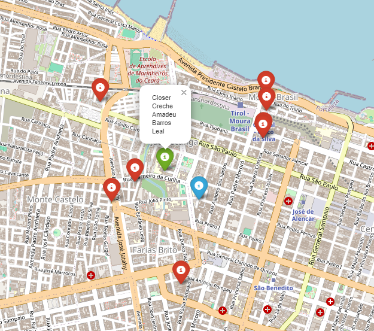

# schools_nearby_postgresql

Schools nearby by geospatial location using Postgresql

This case gets data from schools in Fortaleza - Brazil It treat the data evaluating missing data or dirty data as wrong coordinates. Inform your coordinates to find schools near you.

The blue point represents your location, green point represents the closest school and red points represent other schools considering max distance parameter.

Download shool dataset
https://dados.gov.br/dados/conjuntos-dados/unidades-educacionais-sme

How to run the project:
Use docker-compose.yml whit this command "docker-compose up -d" to create a Postgresql Container. 
Use requirements.txt to set up the Libraries. 
Run school_location.ipynb.

# example of result

